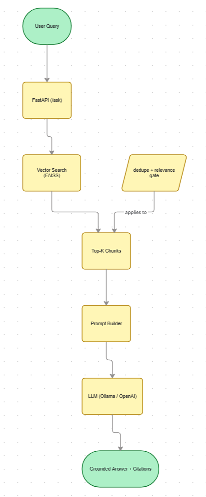

# NLP-Based Document Understanding & Semantic Search Platform

A production‑minded **Retrieval‑Augmented Generation (RAG)** system for document understanding and semantic search.

This project ingests documents (PDFs), chunks and embeds them, performs vector‑based semantic retrieval (FAISS/Chroma), and generates **grounded answers** using an LLM with **explicit citations and relevance gating**.

---

## Key Features

* Document ingestion (PDFs)
* Text cleaning and chunking
* Sentence‑transformer embeddings
* Vector search with FAISS
* RAG with Ollama / OpenAI support
* Page‑level citations with excerpts
* Hallucination guardrails ("I don’t know" on weak evidence)
* Relevance thresholding and deduplication

---

## Project Structure

```
nlp-semantic-search-rag/
├── app/
│   ├── api.py          # FastAPI endpoints
│   ├── rag.py          # LLM + RAG logic
│   ├── retriever.py    # Vector store interaction
│   ├── ingest.py       # PDF ingestion
│   ├── embeddings.py  # Embedding generation
│   ├── schemas.py     # API contracts
│   └── settings.py
├── data/
│   ├── raw/            # Input PDFs (ignored by git)
│   ├── processed/
│   └── index/          # FAISS index + metadata (generated)
├── scripts/
├── tests/
├── bootstrap.sh
├── Makefile
├── requirements.txt
├── .env.example
└── README.md
```

---
## Architecture Overview



---

## Quickstart

```bash
# clone repo
cp .env.example .env

# create virtualenv
python -m venv .venv
source .venv/bin/activate

# install deps
pip install -r requirements.txt

# start API
make run
```

API will be available at:

```
http://localhost:8000
```

---

## Usage

### 1️⃣ Ingest documents

```bash
curl -X POST http://localhost:8000/ingest \
  -H "Content-Type: application/json" \
  -d '{"path":"./data/raw"}'
```

### 2️⃣ Ask questions (RAG)

```bash
curl -X POST http://localhost:8000/ask \
  -H "Content-Type: application/json" \
  -d '{"query":"List the projects mentioned and their status","top_k":6}'
```

Example response:

* Direct answer
* Page‑level citations
* Text excerpts
* Relevance scores

---

## Environment Variables

Defined in `.env`:

```env
LLM_PROVIDER=ollama      # or openai
OLLAMA_MODEL=llama3.2:latest
MIN_RELEVANCE=0.10      # relevance gate
# OPENAI_API_KEY=...
```

---

## Why This Exists

Most RAG demos fail in production because they:

* hallucinate confidently
* ignore evidence quality
* mix retrieval with reasoning

This project demonstrates **how to build RAG correctly**:

* Retrieval and reasoning are separated
* Answers are grounded strictly in evidence
* Weak evidence returns "I don’t know"
* Citations are explicit and inspectable

This makes the system suitable for **real‑world knowledge access, audits, and decision support**.

---

## Status

✅ MVP complete

Possible next steps:

* `/debug/search` endpoint for tuning
* Multi‑document knowledge bases
* Authentication & access control
* CI + tests
* UI layer

---

Built with a strong focus on **correctness, explainability, and production realism**.
